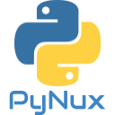

</img>
# PyOS_Linux
PyOS Linux (also known as PyNux) is a python-centered linux distribution designed to be lightweight, performant, and is written almost entirely in python..

It is based on Kubuntu and uses KDE's Window manager along with a custom desktop environment called PyDE (Pynux Desktop Environment), The main features include:
<ul>
    <li>Python-Centered and Lightweight</li>
    <li>Highly customizable</li>
    <li>Versatile Application framework/built-in Python Interpreter named PyEXE (more info <a href="https://github.com/Captian-obvious/PyEXE">here</a>a>)</li>
    <li>Designed to be user friendly</li>
</ul>
<h2>Minimum System</h2>
<ul>
    <li>At least 1 GB of ram</li>
    <li>64-bit instruction support</li>
    <li>At least 3.2 GB of storage (however 10GB is recommended for smooth experience)</li>
</ul>

<em>note: this is a WIP and is not fully finished. Full features are not implemented yet.</em>
